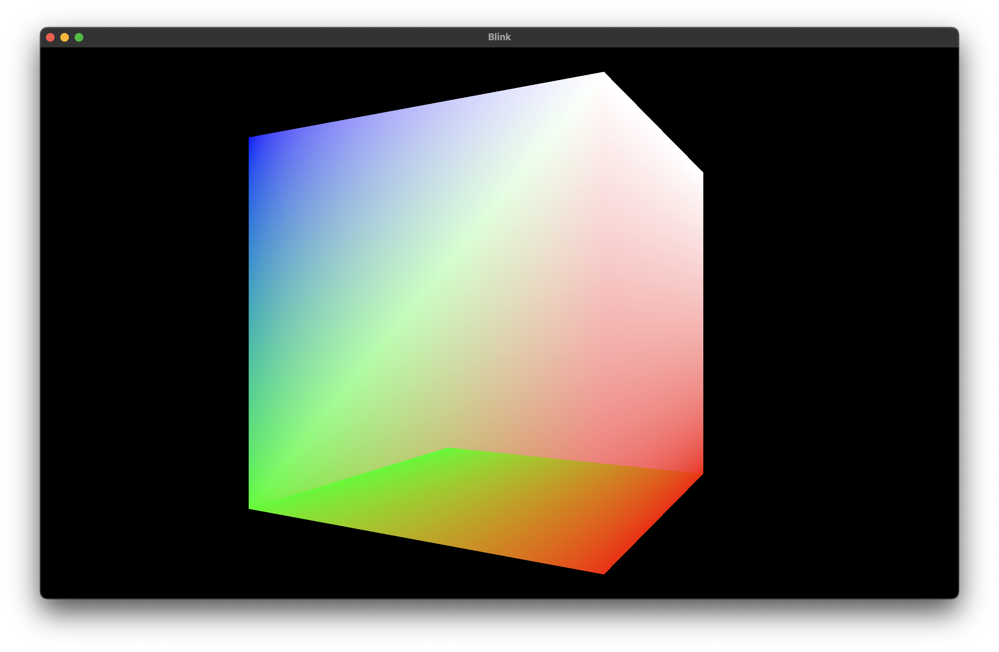

# Blink

<div float="left">
  
</div>

# Table of contents

- :information_desk_person: [Description](#information_desk_person-description)
- :books: [Resources](#books-resources)
- :vertical_traffic_light: [Prerequisites](#vertical_traffic_light-prerequisites)
- :rocket: [Getting started](#rocket-getting-started)
- :building_construction: [CMake](#building_construction-cmake)
  - [Main target](#main-target)
  - [Custom targets](#custom-targets)
  - [Preprocessor macros](#preprocessor-macros)
  - [Dependencies](#dependencies)
  - [Installation](#installation)
  - [Packaging](#packaging)

# :information_desk_person: Description

Proof-of-concept of a game written in C++ featuring Vulkan rendering and embedded Lua

### Features

- Vulkan 3D rendering (very basic/primitive)
- Entity-Component-System using [EnTT][entt]
- Scriptable entities using Lua
- Lua hot-reloading (recompile while app is running)

### Project structure

```
blink/
├─ bin/             # Binary output
├─ build/           # Build files (generated by CMake)
├─ cmake/           # CMake scripts 
├─ dist/            # Packaged application (assembled by CPack)
├─ install/         # Installed application (assembled by CMake)
├─ lua/             # Lua source code to be compiled and embedded in the app
├─ res/             # Resource files like shaders, textures, audio etc.
├─ src/             # C++ source code
├─ CMakeLists.txt   # CMake project config
```

# :books: Resources

| Resource                                                   | Creator                          | Platform |
|------------------------------------------------------------|----------------------------------|----------|
| [Vulkan Game Engine Tutorial][brendangalea:vulkantutorial] | [Brendan Galea][brendangalea]    | YouTube  |
| [Embedding Lua in C++][davepoo:lua]                        | [Dave Poo][davepoo]              | YouTube  |
| [Embedding Lua in C++][javidx9:lua]                        | [javidx9][javidx9]               | YouTube  |
| [Vulkan][getintogamedev:vulkan]                            | [GetIntoGameDev][getintogamedev] | YouTube  |
| [Vulkan C++ examples and demos][saschawillems:vulkan]      | [Sascha Willems][saschawillems]  | GitHub   |
| [C++][thecherno:cpp]                                       | [The Cherno][thecherno]          | YouTube  |
| [Game Engine Series][thecherno:gameengineseries]           | [The Cherno][thecherno]          | YouTube  |    
| [Entity Component System][thecherno:ecs]                   | [The Cherno][thecherno]          | YouTube  |
| [Batch Rendering][thecherno:batchrendering]                | [The Cherno][thecherno]          | YouTube  |          
| [1 Hour Game][thecherno:onehourgame]                       | [The Cherno][thecherno]          | GitHub   |             
| [Vulkan Guide][vkguide]                                    |                                  | Website  |
| [Vulkan Tutorial][vulkantutorial]                          |                                  | Website  |

# :vertical_traffic_light: Prerequisites

- [Git][git]
- [CMake][cmake]
- [Lua][lua]
- [Vulkan][vulkan]
- C++ compiler
    - Windows: [MSVC][msvc] (Bundled with [Visual Studio][msvs])
    - macOS: [Clang][clang] (Bundled with [Xcode][xcode])
    - Linux: [GCC][gcc]

# :rocket: Getting started

**Script**

- Run the app: `./run.sh`

**Manual**

- Generate project files: `cmake -S . -B build/debug`
- Build the binary: `cmake --build build/debug`
- Navigate to the binary output directory: `cd bin/debug`
- Run the binary: `./blink`

# :building_construction: CMake

This project uses [CMake][cmake] to generate platform-specific build files, and to build and package the app using the
generated build files.

The project configuration is defined in the `CMakeLists.txt` file.

**Debug**

```shell
# Generate
cmake -S . -B build/debug

# Build
cmake --build build/debug

# Install
cmake --install build/debug

# Package
cd build/debug
cpack
```

**Release**

```shell
# Generate
cmake -D CMAKE_BUILD_TYPE=Release -S . -B build/release

# Build
cmake --build build/release

# Install
cmake --install build/release

# Package
cd build/release
cpack
```

### Main target

The main target defines which C++ source files and [dependencies](#dependencies) should be compiled into the `blink`
executable.

The built executable is placed in the _runtime output directory_ (`./bin/:buildType`).

### Custom targets

The project defines two custom targets: `CompileLua` and `CompileShaders`.

The main target **depends** on both custom targets to ensure that both lua and shader files are compiled every time the
app is built, regardless if any C++ source files have changed.

#### CompileLua

_Invokes the `cmake/compile_lua.cmake` CMake script which..._

Compiles all `.lua` files in the _Lua source directory_ (`./lua`) into `.out` binary files, and places them in the _Lua
output directory_ (`./bin/:buildType/lua`).

The files are compiled using the [luac][lua:luac] compiler that is bundled with Lua.

```
lua/*.lua   -->   luac   -->   bin/:buildType/lua/*.out   
```

#### CompileShaders

_Invokes the `cmake/compile_shaders.cmake` CMake script which..._

Compiles all `.vert` and `.frag` files in the _shader source directory_ (`./res/shaders`) into `.vert.spv`
and `.frag.spv` [SPIR-V][vulkan:spir] files, and places them in the _shader output
directory_ (`./bin/:buildType/shaders`).

The files are compiled using the glslc compiler that is bundled with Vulkan.

```
res/shaders/*.vert   -->   glslc   -->   bin/:buildType/shaders/*.vert.spv   
res/shaders/*.frag   -->   glslc   -->   bin/:buildType/shaders/*.frag.spv
```

### Preprocessor macros

#### CMAKE_SCRIPTS_DIR

Path to the CMake scripts directory (`./cmake`) used by the app to invoke CMake scripts at runtime.

#### LUA_SOURCE_DIR + LUA_OUTPUT_DIR

Paths to the Lua source directory (`./lua`) and Lua output directory (`./bin/:buildType/lua`).

Used by the app to invoke the `cmake/compile_lua.cmake` CMake script at runtime to facilitate Lua hot-reloading.

### Dependencies

See also [Using Dependencies Guide][cmake:dependencies].

Any dependency also using CMake is automatically fetched and compiled using the [FetchContent][cmake:fetch_content] module.

Dynamically linked dependencies, like Lua and Vulkan, uses the [FindPackage][cmake:find_package] module to find them on the local system. 

### Installation

CMake will install the main target executable and all resource files like compiled lua and shader files, along with dynamically linked libraries and other dependency CMake targets. 

The installed file(s) are placed in the `install` directory.

```shell
cmake --install build/release
```

### Packaging

The app is packaged using [CPack][cmake:cpack]. See also [Packaging with CMake][cmake:cpack:packaging].

Packaging is done by navigating to the directory containing the build files and invoking `cpack`.

The packaged file(s) are placed in the `dist` directory.

```shell
cd build/release
cpack
```

[brendangalea]: https://www.youtube.com/@BrendanGalea

[brendangalea:vulkantutorial]: https://www.youtube.com/watch?v=Y9U9IE0gVHA&list=PL8327DO66nu9qYVKLDmdLW_84-yE4auCR&ab_channel=BrendanGalea

[clang]: http://clang.org/

[cmake]: https://cmake.org/

[cmake:cpack]: https://cmake.org/cmake/help/latest/module/CPack.html

[cmake:cpack:packaging]: https://cmake.org/cmake/help/book/mastering-cmake/chapter/Packaging%20With%20CPack.html

[cmake:dependencies]: https://cmake.org/cmake/help/latest/guide/using-dependencies/index.html#guide:Using%20Dependencies%20Guide

[cmake:fetch_content]: https://cmake.org/cmake/help/latest/module/FetchContent.html#module:FetchContent

[cmake:find_package]: https://cmake.org/cmake/help/latest/command/find_package.html

[davepoo]: https://www.youtube.com/@DavePoo

[davepoo:lua]: https://www.youtube.com/watch?v=xrLQ0OXfjaI&list=PLLwK93hM93Z3nhfJyRRWGRXHaXgNX0Itk&ab_channel=DavePoo

[entt]: https://github.com/skypjack/entt

[gcc]: https://gcc.gnu.org/

[getintogamedev]: https://www.youtube.com/@GetIntoGameDev

[getintogamedev:vulkan]: https://www.youtube.com/playlist?list=PLn3eTxaOtL2NH5nbPHMK7gE07SqhcAjmk

[git]: https://git-scm.com

[glfw]: https://www.glfw.org

[glfw:compile]: https://www.glfw.org/docs/3.3/compile.html

[javidx9]: https://www.youtube.com/@javidx9

[javidx9:lua]: https://www.youtube.com/watch?app=desktop&v=4l5HdmPoynw&t=0s&ab_channel=javidx9

[lua]: https://www.lua.org/

[lua:luac]: https://www.lua.org/manual/5.1/luac.html

[msvc]: https://visualstudio.microsoft.com/vs/features/cplusplus/

[msvs]: https://visualstudio.microsoft.com/

[saschawillems]: https://github.com/SaschaWillems

[saschawillems:vulkan]: https://github.com/SaschaWillems/Vulkan

[thecherno]: https://www.youtube.com/@TheCherno

[thecherno:ecs]: https://www.youtube.com/watch?v=Z-CILn2w9K0&ab_channel=TheCherno

[thecherno]: https://www.youtube.com/@TheCherno

[thecherno:batchrendering]: https://www.youtube.com/watch?v=Th4huqR77rI&list=PLlrATfBNZ98f5vZ8nJ6UengEkZUMC4fy5&ab_channel=TheCherno

[thecherno:cpp]: https://www.youtube.com/watch?v=18c3MTX0PK0&list=PLlrATfBNZ98dudnM48yfGUldqGD0S4FFb&ab_channel=TheCherno

[thecherno:gameengineseries]: https://www.youtube.com/watch?v=JxIZbV_XjAs&list=PLlrATfBNZ98dC-V-N3m0Go4deliWHPFwT&ab_channel=TheCherno

[thecherno:onehourgame]: https://github.com/TheCherno/Hazel1HourGame

[vkguide]: https://vkguide.dev/

[vulkan]: https://vulkan.lunarg.com/

[vulkan:glslc]: https://www.khronos.org/spir/

[vulkan:spir]: https://www.khronos.org/spir/

[vulkantutorial]: https://vulkan-tutorial.com/

[xcode]: https://developer.apple.com/xcode/